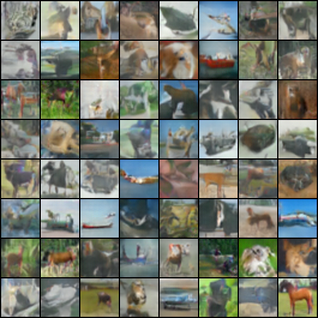

# Spectral Normalization GAN

This example implements [Spectral Normalization for Generative Adversarial Networks](https://arxiv.org/abs/1802.05957) based on [CIFAR10](https://www.cs.toronto.edu/~kriz/cifar.html) dataset.

## Usage

Example runs and the results:

```python
python train.py --use-gpu --data-path=data
```

* Note that the program would download the CIFAR10 for you

`python train.py --help` gives the following arguments:

```bash
optional arguments:
  -h, --help            show this help message and exit
  --data-path DATA_PATH
                        path of data.
  --batch-size BATCH_SIZE
                        training batch size. default is 64.
  --epochs EPOCHS       number of training epochs. default is 100.
  --lr LR               learning rate. default is 0.0001.
  --lr-beta LR_BETA     learning rate for the beta in margin based loss.
                        default is 0.5s.
  --use-gpu             use gpu for training.
  --clip_gr CLIP_GR     Clip the gradient by projecting onto the box. default
                        is 10.0.
  --z-dim Z_DIM         dimension of the latent z vector. default is 100.
```

## Result



## Learned Spectral Normalization


## Reference

[Simple Tensorflow Implementation](https://github.com/taki0112/Spectral_Normalization-Tensorflow)